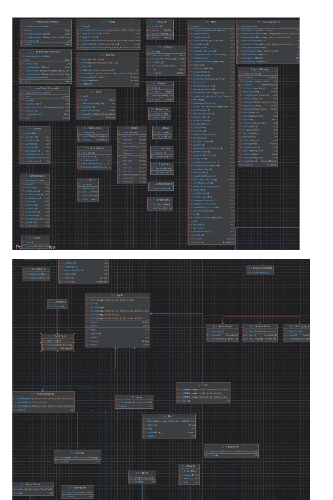
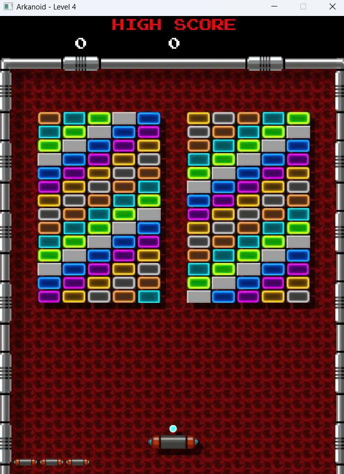
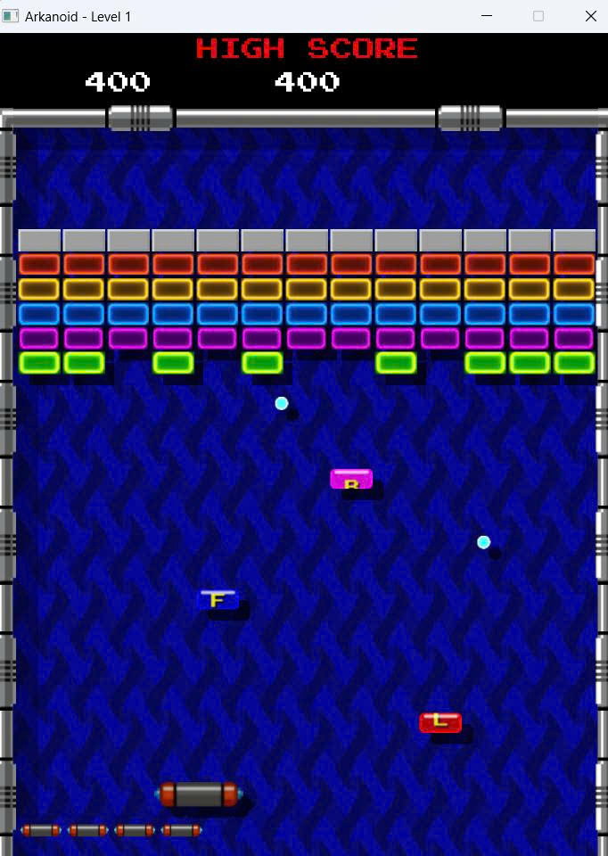

<h1 align="center">🎮 Arkanoid Game - Object-Oriented Programming Project</h1>

---

## 👥 Author
**Group [Số nhóm] – Class [Mã lớp]**
1. [Nguyễn Trung Nghĩa] – [24020251]
2. [Nguyễn Huy Trọng] – [24020332]
3. [Nguyễn Xuân Tiến] – [24020323]

**Instructor:** [Kiều Văn Tuyên , Vũ Minh Hiếu]  
**Semester:** [HK1 – Năm học 2025-2026]

---

## 🧩 Description

This project is a recreation of the classic **Arkanoid game**, developed in **Java** as a **final assignment for the Object-Oriented Programming course**.  
It demonstrates the application of **OOP principles** and a practical understanding of game architecture.

### 🏗️ Key Features
1. Developed using **Java 17+** with **JavaFX/Swing** for the graphical user interface.
2. Implements core OOP principles: **Encapsulation**, **Inheritance**, **Polymorphism**, and **Abstraction**.
3. Uses **a single design pattern – Singleton Pattern** to ensure centralized management of key systems (e.g., game state, audio, and resources).
4. Supports **multithreading** for stable and smooth gameplay.
5. Includes sound effects, animations, and collectible power-ups.
6. **Provides a user interface for both new and returning players**, including player profiles and score tracking.

---

## 🧠 UML Diagram

### Class Diagram

*Full UML diagrams are available in the `docs/uml/` folder.*

---

## 🧩 Design Pattern Implementation

### Singleton Pattern
**Used in:** `Image`

**Purpose:** Ensures that only **one instance** of each manager class exists during runtime to maintain global access and consistency.

---

## 🧵 Multithreading Implementation

The game runs on **three threads** to ensure smooth performance and responsiveness:

1. **Main Thread:**  
   Handles the **core game logic**, including ball movement, collisions, and scoring.

2. **Image Thread (Rendering Thread):**  
   A **dedicated thread** that runs continuously from start to finish, responsible for updating and rendering game graphics.

3. **Audio Thread:**  
   A **temporary thread** created each time a sound effect plays, allowing non-blocking, asynchronous audio playback.

---

## ⚙️ Installation

1. Clone the repository:
## Installation

1. Clone the project from the repository.
2. Open the project in the IDE.
3. Run the project.

## Usage

### Controls
| Key | Action |
|-----|--------|
| `←` or `A` | Move paddle left |
| `→` or `D` | Move paddle right |
| `SPACE` | Launch ball / Shoot laser |
|  `ESC` | Pause game |

|

### How to Play
1. **Start the game**: Click "New Game" from the main menu.
2. **Control the paddle**: Use arrow keys or A/D to move left and right.
3. **Launch the ball**: Press SPACE to launch the ball from the paddle.
4. **Destroy bricks**: Bounce the ball to hit and destroy bricks.
5. **Collect power-ups**: Catch falling power-ups for special abilities.
6. **Avoid losing the ball**: Keep the ball from falling below the paddle.
7. **Complete the level**: Destroy all destructible bricks to advance.

### Power-ups
| Icon | Name          | Effect |
|-----|---------------|--------|
| 🟦  | Expand Paddle | Increases paddle width for 10 seconds |
| 🟥  | Shrink Paddle | Decreases paddle width for 10 seconds |
| ⚡   | Fast Ball     | Increases ball speed by 30% |
| 🐌  | Slow Ball     | Decreases ball speed by 30% |
| 🎯  | Multi Ball    | Spawns 2 additional balls |
| 🔫  | Laser Gun     | Shoot lasers to destroy bricks for 15 seconds |
| 🧲  | Magnet        | Ball sticks to paddle, launch with SPACE |
| 🚪  | Next Level    | Opens the door to proceed to the next stage |

### Scoring System
- Gray Block, goldblock : 0 point
- WhiteBlock : 10 points
- Orange Block : 60 points
- Lime Block : 70 points
- Ruby Block : 80 points
- Blue Block : 90 points
- MGNT Block : 100 points
- Yellow Block : 110 points

---

## Demo

### Screenshots

**Main Menu**  

**Gameplay**  

**Power-ups in Action**  

**Leaderboard**  

### Video Demo

*Full gameplay video is available in `docs/demo/gameplay.mp4`*

---

## Future Improvements

### Planned Features
1. **Additional game modes**
    - Time attack mode
    - Survival mode with endless levels
    - Co-op multiplayer mode

2. **Enhanced gameplay**
    - Boss battles at end of worlds
    - More power-up varieties (freeze time, shield wall, etc.)
    - Achievements system

3. **Technical improvements**
    - Migrate to LibGDX or JavaFX for better graphics
    - Add particle effects and advanced animations
    - Implement AI opponent mode
    - Add online leaderboard with database backend

---

## Technologies Used

| Technology | Version | Purpose |
|------------|---------|---------|
| Java | 17+ | Core language |
| JavaFX | 19.0.2 | GUI framework |
| Maven | 3.9+ | Build tool |
| Jackson | 2.15.0 | JSON processing |

---

## License

This project is developed for educational purposes only.

**Academic Integrity:** This code is provided as a reference. Please follow your institution's academic integrity policies.

---

## Notes

- The game was developed as part of the Object-Oriented Programming with Java course curriculum.
- All code is written by group members with guidance from the instructor.
- Some assets (images, sounds) may be used for educational purposes under fair use.
- The project demonstrates practical application of OOP concepts and design patterns.

---

*Last updated: [Ngày/Tháng/Năm]*
